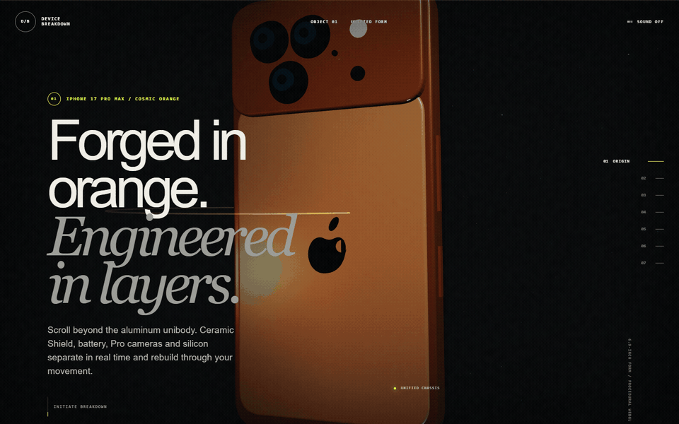
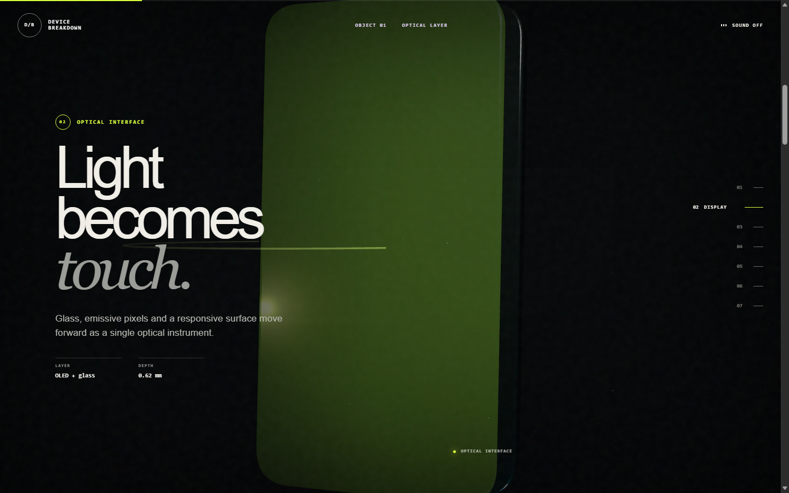
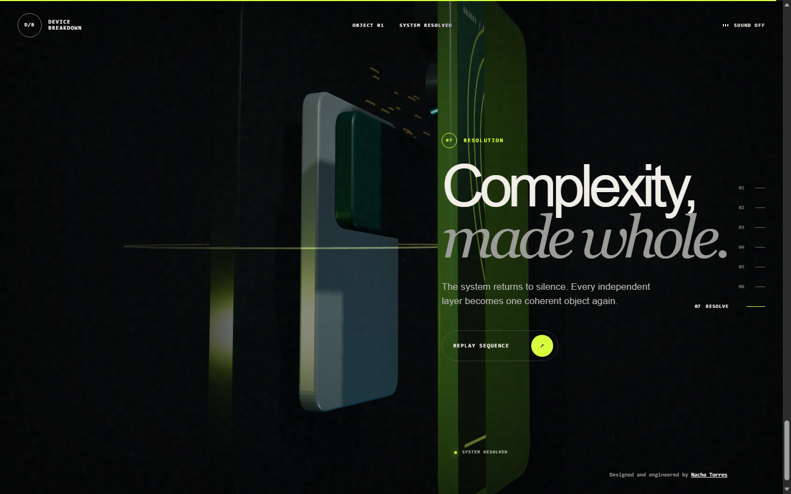

# Device Breakdown Experience

[](https://device.ntdesweb.dev/)

A cinematic, scroll-directed WebGL teardown of a procedural premium smartphone. The experience moves through glass, display, battery, camera, logic board and silicon before resolving every layer back into one object.



## Experience design

- Seven reversible narrative chapters driven by scroll position.
- Procedural smartphone geometry—no downloaded 3D model or texture payload.
- Physical layer separation with independent drift, focus and reassembly states.
- Responsive camera choreography, parallax, dynamic lighting, glow, fog and glass.
- Optional synthesized interface sound using the Web Audio API.
- Adaptive rendering with capped pixel ratio, reduced particle counts on coarse pointers and tab-visibility pausing.

## Captures

| Optical layer | Silicon / resolution |
| --- | --- |
|  |  |

## Technology

- Semantic HTML5
- Modern CSS, container-safe responsive composition and accessible motion fallbacks
- Vanilla JavaScript
- Three.js `0.160.0`
- WebGL, Canvas textures, Web Audio API and IntersectionObserver

## Run locally

No build step is required.

```bash
python -m http.server 8080
```

Open `http://localhost:8080`.

## Deploy

This is a static project. For Cloudflare Pages:

1. Import `NachoTorresRD/device-breakdown-experience`.
2. Framework preset: `None`.
3. Build command: leave empty.
4. Output directory: `/`.
5. Attach the custom domain `device.ntdesweb.dev`.

The included `_headers`, `robots.txt` and `sitemap.xml` are ready for the production domain.

## Accessibility and performance

- Keyboard-accessible chapter navigation and controls.
- Visible focus treatment and semantic document landmarks.
- `prefers-reduced-motion` support with immediate scene interpolation.
- Text narrative remains readable when WebGL is unavailable.
- Renderer pixel ratio is capped and shadow/particle cost adapts to mobile input.

## License

[MIT](LICENSE) © 2026 Nacho Torres.
